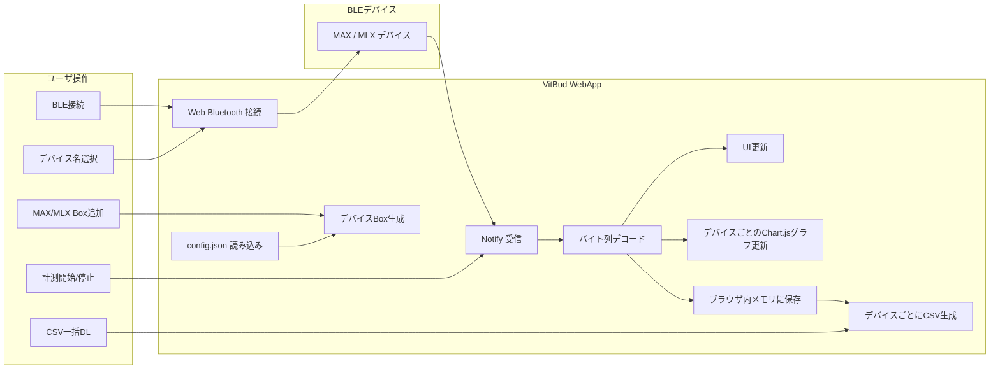

<div id="top"></div>

# VitBud WebApp

VitBud WebApp は，Web Bluetooth を用いて MAX30102 系デバイスと MLX90632 系デバイスをブラウザ上で接続し，脈波データおよび赤外線温度データをリアルタイムに可視化・保存する Web アプリケーションである．

MAX デバイスおよび MLX デバイスは，それぞれ 0〜5 台まで任意に追加できる．追加したデバイスBoxごとに BLE 接続，リアルタイム表示，グラフ表示，CSV保存を行う．  
デバイス候補名，UUID，サンプルサイズ，グラフ表示点数，距離判定閾値などの設定は `config.json` で管理する．

---

## 使用技術一覧

<p style="display: inline">
  
  
  
  
  
  
  
  
  
</p>

---

## 目次

- [プロジェクトについて](#プロジェクトについて)
- [ファイル構成](#ファイル構成)
- [利用ライブラリ](#利用ライブラリ)
- [対応デバイス](#対応デバイス)
- [設定ファイル](#設定ファイル)
- [BLE通信仕様](#ble通信仕様)
- [画面構成](#画面構成)
- [計測開始条件](#計測開始条件)
- [グラフ表示](#グラフ表示)
- [保存データ](#保存データ)
- [データフロー](#データフロー)
- [使用方法](#使用方法)
- [注意点](#注意点)
- [今後の拡張案](#今後の拡張案)

---

## プロジェクトについて

VitBud WebApp は，耳装着型デバイスに接続された MAX30102 系センサと MLX90632 系センサを，ブラウザ上で接続・計測するための Web アプリケーションである．

本アプリでは，MAX デバイスと MLX デバイスをそれぞれ動的に追加できる．  
初期状態では各パネルにデバイスBoxは表示されず，ユーザが「＋ MAX デバイス追加」または「＋ MLX デバイス追加」を押すことで，接続用Boxを追加する．

各Boxでは，BLEデバイスの選択，接続，解除，状態表示，リアルタイムデータ表示，個別グラフ表示を行う．  
計測後は，追加されている各デバイスのデータを個別のCSVファイルとして連続ダウンロードする．

<p align="right">(<a href="#top">トップへ戻る</a>)</p>

---

## ファイル構成

```text
.
├── index.html
├── style.css
├── app.js
├── config.json
└── README.md
````

### index.html

画面構造を定義するファイルである．
MAXパネル，MLXパネル，デバイス追加ボタン，計測開始ボタン，CSVダウンロードボタンを持つ．

### style.css

画面の見た目を定義するファイルである．
レイアウト，パネル，ボタン，デバイスBox，デバイスごとのグラフ領域などのスタイルをまとめている．

### app.js

Web Bluetooth による接続，通知受信，データ処理，グラフ更新，CSV出力を担当する．
`config.json` を読み込み，設定値を反映して動作する．

### config.json

デバイス候補名，BLE UUID，サンプルサイズ，グラフ表示点数，距離判定閾値，最大デバイス数などを管理する設定ファイルである．

<p align="right">(<a href="#top">トップへ戻る</a>)</p>

---

## 利用ライブラリ

本アプリは以下の外部ライブラリを使用する．

* **Chart.js**

  * リアルタイムグラフ描画に使用する．

`index.html` 内で CDN から読み込む．

```html
<script src="https://cdn.jsdelivr.net/npm/chart.js"></script>
```

CSVファイル生成には外部ライブラリを使用せず，JavaScript の `Blob` と `download` 属性を用いる．

<p align="right">(<a href="#top">トップへ戻る</a>)</p>

---

## 対応デバイス

### MAX 系デバイス

MAX30102 を用いた脈波取得デバイスを想定する．
本アプリでは，MAX から送信される IR/RED の RAW データを受信する．

`config.json` に登録されている候補名は以下である．

```json
[
  "MAX R",
  "MAX R mini",
  "MAX L",
  "MAX L mini",
  "MAX fin",
  "MAX bub"
]
```

### MLX 系デバイス

MLX90632 を用いた赤外線温度取得デバイスを想定する．
Ambient 温度，Object 温度，Raw Ambient，Raw Object を受信する．

`config.json` に登録されている候補名は以下である．

```json
[
  "MLX R",
  "MLX R mini",
  "MLX L",
  "MLX L mini"
]
```

<p align="right">(<a href="#top">トップへ戻る</a>)</p>

---

## 設定ファイル

`config.json` では，アプリ名，バージョン，接続条件，BLE通信仕様，デバイス候補名などを管理する．

主な設定項目は以下である．

| 項目                                | 内容                          |
| --------------------------------- | --------------------------- |
| `app.name`                        | アプリ名                        |
| `app.version`                     | バージョン                       |
| `app.requireAllDevices`           | 追加されているBoxすべての接続を計測開始条件にするか |
| `app.maxDevicesPerSensor`         | MAX/MLXそれぞれの最大Box数          |
| `sensors.MAX.serviceUUID`         | MAXのBLE Service UUID        |
| `sensors.MAX.characteristicUUID`  | MAXのBLE Characteristic UUID |
| `sensors.MAX.sampleByteSize`      | MAXの1サンプルのバイト数              |
| `sensors.MAX.plotCount`           | MAXグラフに表示する最大点数             |
| `sensors.MAX.distanceIrThreshold` | MAXの距離判定閾値                  |
| `sensors.MAX.deviceNames`         | MAXの候補デバイス名                 |
| `sensors.MLX.serviceUUID`         | MLXのBLE Service UUID        |
| `sensors.MLX.characteristicUUID`  | MLXのBLE Characteristic UUID |
| `sensors.MLX.sampleByteSize`      | MLXの1サンプルのバイト数              |
| `sensors.MLX.plotCount`           | MLXグラフに表示する最大点数             |
| `sensors.MLX.deviceNames`         | MLXの候補デバイス名                 |

<p align="right">(<a href="#top">トップへ戻る</a>)</p>

---

## BLE通信仕様

### MAX

MAX は RAW データ用 Characteristic から通知を受信する．

```json
{
  "serviceUUID": "3a5197ff-07ce-499e-8d37-d3d457af549a",
  "characteristicUUID": "abcdef01-1234-5678-1234-56789abcdef1",
  "sampleByteSize": 12
}
```

1 サンプルは 12 byte であり，以下の順に格納される．

| Offset | 型      | 内容               |
| -----: | ------ | ---------------- |
|      0 | uint32 | IR Value         |
|      4 | uint32 | RED Value        |
|      8 | uint32 | SensorElapsed_ms |

リトルエンディアンで読み取る．

### MLX

MLX は温度データ用 Characteristic から通知を受信する．

```json
{
  "serviceUUID": "4a5197ff-07ce-499e-8d37-d3d457af549a",
  "characteristicUUID": "fedcba98-7654-3210-fedc-ba9876543210",
  "sampleByteSize": 16
}
```

1 サンプルは 16 byte であり，以下の順に格納される．

| Offset | 型       | 内容               |
| -----: | ------- | ---------------- |
|      0 | float32 | Ambient_C        |
|      4 | float32 | Object_C         |
|      8 | int16   | Raw_Ambient      |
|     10 | int16   | Raw_Object       |
|     12 | uint32  | SensorElapsed_ms |

リトルエンディアンで読み取る．

<p align="right">(<a href="#top">トップへ戻る</a>)</p>

---

## 画面構成

### 全体

画面上部には，以下のボタンを配置する．

* 計測開始 / 計測停止
* 一括ダウンロード（CSV）

画面下部には，MAXパネルとMLXパネルを配置する．
各パネルには，デバイス追加ボタンとデバイスBox一覧を表示する．

### MAXパネル

MAXパネルでは，「＋ MAX デバイス追加」ボタンを押すことでMAX用Boxを追加する．
各Boxでは以下を表示する．

* デバイス名選択プルダウン
* 接続ボタン
* 解除ボタン
* 接続状態
* 接続デバイス名
* 計測開始からの経過時間
* 距離状態
* IR/RED の個別グラフ

距離状態は IR Value に基づいて判定する．
IR Value が `distanceIrThreshold` 未満の場合は「離れています」，閾値以上の場合は「正常」と表示する．

### MLXパネル

MLXパネルでは，「＋ MLX デバイス追加」ボタンを押すことでMLX用Boxを追加する．
各Boxでは以下を表示する．

* デバイス名選択プルダウン
* 接続ボタン
* 解除ボタン
* 接続状態
* 接続デバイス名
* Ambient 温度
* Object 温度
* 計測開始からの経過時間
* Object温度の個別グラフ

<p align="right">(<a href="#top">トップへ戻る</a>)</p>

---

## 計測開始条件

`config.json` の `app.requireAllDevices` により，計測開始条件を切り替える．

```json
{
  "requireAllDevices": true
}
```

`true` の場合，追加されているすべてのデバイスBoxが接続済みのときに計測開始できる．
`false` の場合，1台以上のデバイスが接続されていれば計測開始できる．

デバイスBoxが1つも追加されていない場合，計測は開始できない．

<p align="right">(<a href="#top">トップへ戻る</a>)</p>

---

## グラフ表示

### MAXグラフ

MAXでは，デバイスBoxごとに個別のグラフを表示する．
各グラフには以下の2系列を表示する．

* IR
* RED

IR と RED は別の Y 軸で表示する．
表示点数は `config.json` の `sensors.MAX.plotCount` に従う．

### MLXグラフ

MLXでは，デバイスBoxごとに個別のグラフを表示する．
各グラフには以下の1系列を表示する．

* Object 温度

表示点数は `config.json` の `sensors.MLX.plotCount` に従う．

<p align="right">(<a href="#top">トップへ戻る</a>)</p>

---

## 保存データ

計測データは，追加されている各デバイスBoxごとにブラウザ上のメモリへ蓄積される．
「一括ダウンロード（CSV）」を押すと，存在するデバイスBoxの数に応じて，CSVファイルを連続ダウンロードする．

CSVファイル名は以下の形式である．

```text
deviceName_yyyy-mm-dd-hh-mm.csv
```

デバイス名に空白が含まれる場合，空白は `_` に置き換える．
例：

```text
MAX_R_2026-05-12-14-30.csv
MAX_bub_2026-05-12-14-30.csv
MLX_L_mini_2026-05-12-14-30.csv
```

### MAX の保存列

| 列名               | 内容                       |
| ---------------- | ------------------------ |
| IR_Value         | IR の RAW 値               |
| RED_Value        | RED の RAW 値              |
| SensorElapsed_ms | マイコン側の経過時間 [ms]          |
| RecvEpoch_ms     | ブラウザが受信した時刻 [epoch ms]   |
| RecvJST          | ブラウザが受信したローカル時刻          |
| MeasureElapsed_s | WebApp 側の計測開始からの経過時間 [s] |

### MLX の保存列

| 列名               | 内容                       |
| ---------------- | ------------------------ |
| Ambient_C        | Ambient 温度 [°C]          |
| Object_C         | Object 温度 [°C]           |
| Raw_Ambient      | Raw Ambient 値            |
| Raw_Object       | Raw Object 値             |
| SensorElapsed_ms | マイコン側の経過時間 [ms]          |
| MeasureElapsed_s | WebApp 側の計測開始からの経過時間 [s] |
| RecvEpoch_ms     | ブラウザが受信した時刻 [epoch ms]   |
| RecvJST          | ブラウザが受信したローカル時刻          |

<p align="right">(<a href="#top">トップへ戻る</a>)</p>

---

## データフロー



<p align="right">(<a href="#top">トップへ戻る</a>)</p>

---

## 使用方法

### 1．WebAppを開く

VercelなどにデプロイしたURLを開く．
ローカルで確認する場合は，`config.json` を `fetch()` で読み込むため，`index.html` を直接ダブルクリックせず，ローカルサーバ経由で開く．

例：

```bash
python -m http.server 8000
```

ブラウザで以下にアクセスする．

```text
http://localhost:8000
```

### 2．デバイスBoxを追加する

MAXを接続する場合は，「＋ MAX デバイス追加」を押す．
MLXを接続する場合は，「＋ MLX デバイス追加」を押す．

各センサ種別につき，0〜5台まで追加できる．

### 3．デバイス名を選択する

追加されたBox内のプルダウンから，接続したいBLEデバイス名を選択する．

### 4．接続する

各Boxの「接続」ボタンを押し，BLEデバイスを選択して接続する．
接続に成功すると，状態が「接続済み」になり，接続したデバイス名が表示される．

### 5．計測を開始する

必要なデバイスが接続されると，「計測開始」ボタンが有効化される．
ボタンを押すと，追加されている各デバイスの通知受信を開始する．

### 6．データを確認する

計測中は，各Box内の数値表示と個別グラフがリアルタイムに更新される．

### 7．計測を停止する

計測中に「計測停止」ボタンを押すと，各デバイスの通知受信を停止する．

### 8．CSVを保存する

データが1件以上受信されると，「一括ダウンロード（CSV）」ボタンが有効化される．
ボタンを押すと，追加されている各デバイスごとにCSVファイルを連続ダウンロードする．

<p align="right">(<a href="#top">トップへ戻る</a>)</p>

---

## 注意点

* Web Bluetooth は対応ブラウザでのみ使用できる．
* iOS Safari では Web Bluetooth が利用できない場合がある．
* Web Bluetooth を使用するため，HTTPS環境または `localhost` で開く必要がある．
* `config.json` は `index.html` と同じ階層に配置する．
* `config.json` を変更した場合は，ページを再読み込みする．
* デバイス名は Arduino 側の BLE アドバタイズ名と一致させる．
* MAX と MLX の送信バイト列は，この README の仕様と一致させる．
* 計測中はデバイスBoxの追加・削除を行わない．
* 計測後，接続を解除しても保存済みデータは消えない．
* 新しい計測を開始すると，前回のブラウザ内データとグラフはリセットされる．
* 1クリックで複数CSVを保存するため，ブラウザによっては複数ファイルのダウンロード許可を求められる場合がある．

<p align="right">(<a href="#top">トップへ戻る</a>)</p>