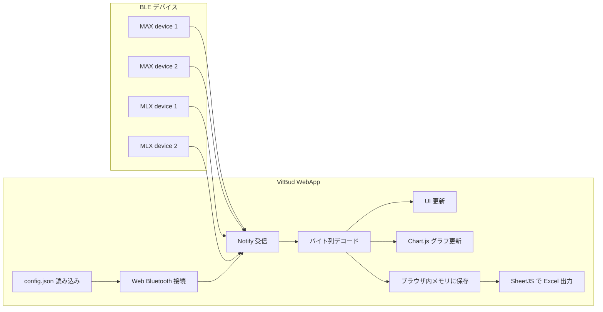

<div id="top"></div>

# VitBud WebApp

---

## 使用技術一覧

<p style="display: inline">
  
  
  
  
  
  
  
  
  
</p>

---

## 目次
- [プロジェクトについて](#プロジェクトについて)
- [ファイル構成](#ファイル構成)
- [利用ライブラリ](#利用ライブラリ)
- [対応デバイス](#対応デバイス)
- [BLE通信仕様](#BLE通信仕様)
- [スロット構成](#スロット構成)
- [画面構成](#画面構成)
- [グラフ表示](#グラフ表示)
- [保存データ](#保存データ)
- [データフロー](#データフロー)
- [使用方法](#使用方法)
- [注意点](#注意点)
---

## 1．プロジェクトについて


VitBud WebApp は，Web Bluetooth を用いて MAX30102 系デバイスと MLX90632 系デバイスをブラウザ上で接続し，リアルタイム表示および Excel 形式でのデータ保存を行う Web アプリケーションである．

本アプリは，MAX デバイス 2 台，MLX デバイス 2 台の計 4 台を同時に扱う構成を基本とする．  
デバイス候補名，UUID，サンプルサイズ，グラフ表示点数，距離判定閾値などの設定は `config.json` で管理す
る．

<p align="right">(<a href="#top">トップへ戻る</a>)</p>

---

## 2．ファイル構成

```text
.
├── index.html
├── style.css
├── app.js
├── config.json
└── README.md
````

### index.html

画面構造を定義するファイルである．
MAX 2 台，MLX 2 台の接続欄，状態表示欄，リアルタイムグラフ表示欄を持つ．

### style.css

画面の見た目を定義するファイルである．
レイアウト，パネル，ボタン，デバイス選択欄，グラフ領域などのスタイルをまとめている．

### app.js

Web Bluetooth による接続，通知受信，データ処理，グラフ更新，Excel 出力を担当する．
`config.json` を読み込み，設定値を反映して動作する．

### config.json

デバイス候補名，BLE UUID，サンプルサイズ，グラフ表示点数，距離判定閾値，スロット設定を管理する設定ファイルである．

<p align="right">(<a href="#top">トップへ戻る</a>)</p>

---

## 3．利用ライブラリ

本アプリは以下の外部ライブラリを使用する．

* Chart.js

  * リアルタイムグラフ描画に使用する．
* SheetJS/xlsx

  * Excel ファイルの生成に使用する．

`index.html` 内で CDN から読み込んでいる．

```html
<script src="https://cdn.jsdelivr.net/npm/chart.js"></script>
<script src="https://cdn.jsdelivr.net/npm/xlsx/dist/xlsx.full.min.js"></script>
```

<p align="right">(<a href="#top">トップへ戻る</a>)</p>

---

## 4．対応デバイス

### MAX 系デバイス

MAX30102 を用いた脈波取得デバイスを想定する．
現在の実装では，BPM ではなく，MAX から送信される IR/RED の RAW データを受信する．

`config.json` に登録されている候補名は以下である．

```json
[
  "MAX R",
  "MAX R mini",
  "MAX L",
  "MAX L mini",
  "MAX fin",
  "MAX bub"
]
```

### MLX 系デバイス

MLX90632 を用いた赤外線温度取得デバイスを想定する．
Ambient 温度，Object 温度，Raw Ambient，Raw Object を受信する．

`config.json` に登録されている候補名は以下である．

```json
[
  "MLX R",
  "MLX R mini",
  "MLX L",
  "MLX L mini"
]
```

<p align="right">(<a href="#top">トップへ戻る</a>)</p>

---

## 5．BLE 通信仕様

### MAX

MAX は RAW データ用 Characteristic から通知を受信する．

```json
{
  "serviceUUID": "3a5197ff-07ce-499e-8d37-d3d457af549a",
  "characteristicUUID": "abcdef01-1234-5678-1234-56789abcdef1",
  "sampleByteSize": 12
}
```

1 サンプルは 12 byte であり，以下の順に格納される．

| Offset | 型      | 内容               |
| -----: | ------ | ---------------- |
|      0 | uint32 | IR Value         |
|      4 | uint32 | RED Value        |
|      8 | uint32 | SensorElapsed_ms |

リトルエンディアンで読み取る．

### MLX

MLX は温度データ用 Characteristic から通知を受信する．

```json
{
  "serviceUUID": "4a5197ff-07ce-499e-8d37-d3d457af549a",
  "characteristicUUID": "fedcba98-7654-3210-fedc-ba9876543210",
  "sampleByteSize": 16
}
```

1 サンプルは 16 byte であり，以下の順に格納される．

| Offset | 型       | 内容               |
| -----: | ------- | ---------------- |
|      0 | float32 | Ambient_C        |
|      4 | float32 | Object_C         |
|      8 | int16   | Raw_Ambient      |
|     10 | int16   | Raw_Object       |
|     12 | uint32  | SensorElapsed_ms |

リトルエンディアンで読み取る．

<p align="right">(<a href="#top">トップへ戻る</a>)</p>

---

## 6．スロット構成

本アプリでは，画面上の4つの接続枠をスロットとして扱う．

| Slot | 種別  | 初期表示          |
| ---- | --- | ------------- |
| max1 | MAX | デバイス 1（MAX R） |
| max2 | MAX | デバイス 2（MAX L） |
| mlx1 | MLX | デバイス 3（MLX R） |
| mlx2 | MLX | デバイス 4（MLX L） |

スロット名と初期表示名は `config.json` の `slots` で管理する．

<p align="right">(<a href="#top">トップへ戻る</a>)</p>

---

## 7．画面構成

### MAX

MAX では以下を表示する．

* 接続状態
* 接続デバイス名
* 計測開始からの経過時間
* 距離状態

距離状態は IR Value に基づいて判定する．
判定閾値は `config.json` の `distanceIrThreshold` で管理する．

```json
{
  "distanceIrThreshold": 50000
}
```

IR Value が閾値未満の場合は「離れています」，閾値以上の場合は「正常」と表示する．

### MLX

MLX では以下を表示する．

* 接続状態
* 接続デバイス名
* Ambient 温度
* Object 温度
* 計測開始からの経過時間

<p align="right">(<a href="#top">トップへ戻る</a>)</p>

---

## 8．グラフ表示

### MAX グラフ

MAX グラフは，IR/RED の RAW データを表示する．

* IR Dev1
* RED Dev1
* IR Dev2
* RED Dev2

デバイス1は実線，デバイス2は点線で表示する．
IR と RED は別の Y 軸で表示する．

表示点数は `config.json` の `plotCount` で管理する．

```json
{
  "plotCount": 100
}
```

### MLX グラフ

MLX グラフは，Object 温度を表示する．

* Obj Dev3
* Obj Dev4

表示点数は `config.json` の `plotCount` で管理する．

```json
{
  "plotCount": 50
}
```

<p align="right">(<a href="#top">トップへ戻る</a>)</p>

---

## 9．保存データ

計測データはブラウザ上のメモリに蓄積される．
「一括ダウンロード（Excel）」を押すと，SheetJS により Excel ファイルを生成する．

出力ファイル名は以下である．

```text
VitSence_4Dev_Measurement.xlsx
```

シート名は，接続時に選択したデバイス名を使用する．
デバイス名が取得できない場合は，`MAX1`，`MAX2`，`MLX1`，`MLX2` を使用する．

### MAX の保存列

| 列名               | 内容                       |
| ---------------- | ------------------------ |
| IR_Value         | IR の RAW 値               |
| RED_Value        | RED の RAW 値              |
| SensorElapsed_ms | マイコン側の経過時間 [ms]          |
| RecvEpoch_ms     | ブラウザが受信した時刻 [epoch ms]   |
| RecvJST          | ブラウザが受信したローカル時刻          |
| MeasureElapsed_s | WebApp 側の計測開始からの経過時間 [s] |

### MLX の保存列

| 列名               | 内容                       |
| ---------------- | ------------------------ |
| Ambient_C        | Ambient 温度 [°C]          |
| Object_C         | Object 温度 [°C]           |
| Raw_Ambient      | Raw Ambient 値            |
| Raw_Object       | Raw Object 値             |
| SensorElapsed_ms | マイコン側の経過時間 [ms]          |
| MeasureElapsed_s | WebApp 側の計測開始からの経過時間 [s] |
| RecvEpoch_ms     | ブラウザが受信した時刻 [epoch ms]   |
| RecvJST          | ブラウザが受信したローカル時刻          |

<p align="right">(<a href="#top">トップへ戻る</a>)</p>

---

## 10．データフロー



<p align="right">(<a href="#top">トップへ戻る</a>)</p>

---

## 11．使用方法

### 1．ローカルサーバを起動する

`config.json` を `fetch()` で読み込むため，`index.html` を直接ダブルクリックして開くのではなく，ローカルサーバ経由で開く．

例：

```bash
python -m http.server 8000
```

ブラウザで以下にアクセスする．

```text
http://localhost:8000
```

Vercel 等にデプロイする場合は，`index.html`，`style.css`，`app.js`，`config.json` を同じ階層に配置する．

### 2．デバイスを選択する

各スロットのプルダウンから接続するデバイス名を選択する．

### 3．接続する

各スロットの「接続」ボタンを押し，BLE デバイスを選択して接続する．

### 4．計測を開始する

必要なデバイスが接続されると「計測開始」ボタンが有効化される．
ボタンを押すと，各デバイスの通知受信を開始する．

### 5．計測を停止する

計測中に「計測停止」ボタンを押すと，各デバイスの通知受信を停止する．

### 6．データを保存する

データが1件以上受信されると「一括ダウンロード（Excel）」ボタンが有効化される．
ボタンを押すと，Excel ファイルを保存する．

<p align="right">(<a href="#top">トップへ戻る</a>)</p>

---

## 12．注意点

* Web Bluetooth は対応ブラウザでのみ使用できる．
* iOS Safari では Web Bluetooth が利用できない場合がある．
* `config.json` は `index.html` と同じ階層に配置する．
* `config.json` を変更した場合は，ページを再読み込みする．
* デバイス名は Arduino 側の BLE アドバタイズ名と一致させる．
* MAX と MLX の送信バイト列は，この README の仕様と一致させる．
* 計測後，接続を解除しても保存済みデータは消えない．
* 新しい計測を開始すると，前回のブラウザ内データとグラフはリセットされる．

<p align="right">(<a href="#top">トップへ戻る</a>)</p>